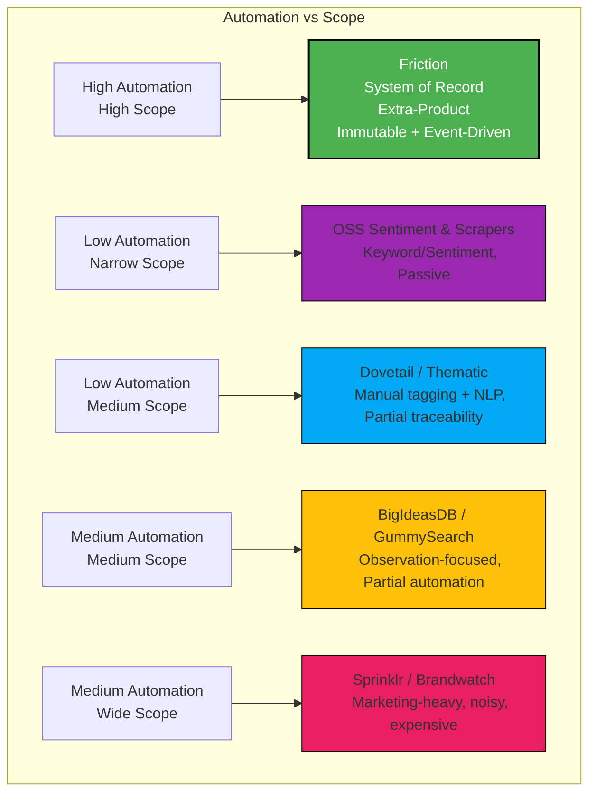

# Friction: Automation vs Scope

This map shows how Friction stacks against competitors in terms of **automation** (Y-axis) and **scope / coverage** (X-axis). It clearly positions Friction as **high automation + cross-domain coverage**, unlike other tools.

**How to read this map:**

1. **Y-Axis:** Automation
   - OSS & Workflow: low to medium
   - Pain Scouts: medium
   - Friction: high
2. **X-Axis:** Scope / Coverage
   - OSS: narrow (single source / sentiment)
   - Workflow Repos: medium (internal research only)
   - Enterprise: wide but noisy / marketing-heavy
   - Friction: high (multi-source, cross-domain, developer-focused)
3. **Takeaway:** Friction occupies the **top-right quadrant**, making it the only tool that is both **automated** and **cross-domain**, with **immutable provenance** and **developer-first APIs**.