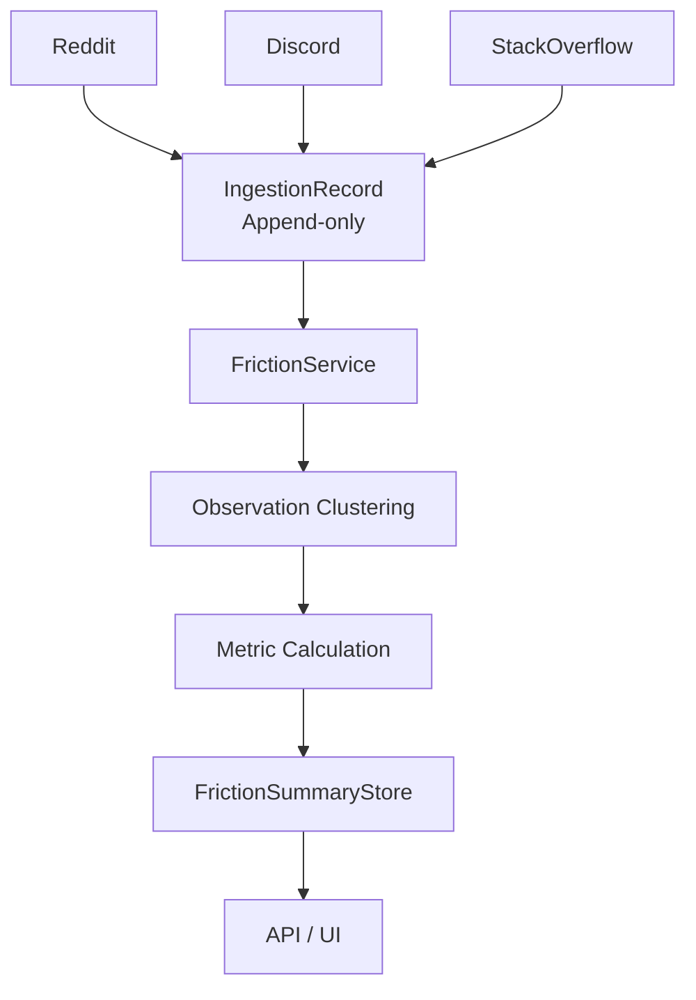
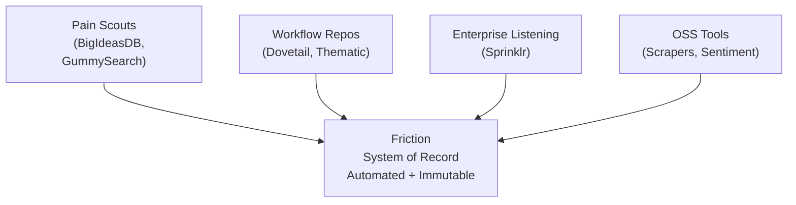
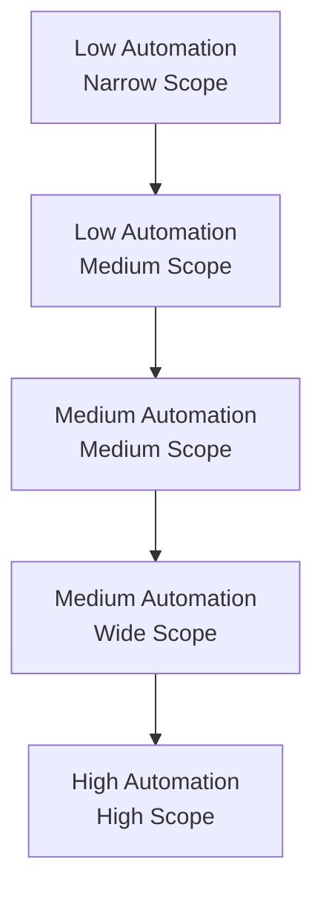

# Friction: Brief Market & Competitive Analysis & Executive Positioning

**Friction is a System of Record for unresolved challenges.**
It captures **traceable, immutable evidence of systemic pain** across public communities and preserves provenance from ingestion to metric. Friction does not recommend solutions; it **surfaces evidence** so builders decide.

## Problem Space

Most tools answer: *“What should we build to make money?”*
Friction answers: *“What pain is real, recurring, and provable?”*

Key failures in the market today:

- **Insight decay**: summaries overwrite context.
- **Black-box NLP**: scores without provenance.
- **Manual workflows**: tagging does not scale.
- **Keyword bias**: misses conceptually similar complaints.

## Competitor Landscape

### A. Pain Point Scouts (Direct)

| Tool                     | Primary Use             | Limitations                             |
| ------------------------ | ----------------------- | --------------------------------------- |
| BigIdeasDB               | Reddit problem database | Interpreted outputs, limited provenance |
| GummySearch              | Audience research       | Legacy, partial automation              |
| SignalScouter / Redreach | Social selling          | Engagement-first, not evidence-first    |

**Friction difference:** observation-only, immutable, cross-source clustering.

### B. Qualitative Research Repositories (Workflow)

| Tool                   | Use Case                   | Limitation        |
| ---------------------- | -------------------------- | ----------------- |
| Dovetail               | Manual tagging & synthesis | Human bottleneck  |
| Thematic / Chattermill | NLP on feedback            | Black-box metrics |

**Friction difference:** automated ingestion, metric-driven synthesis, full traceability.

### C. Enterprise Social Listening

| Tool                  | Audience       | Limitation                      |
| --------------------- | -------------- | ------------------------------- |
| Sprinklr / Brandwatch | Marketing / PR | Noisy, expensive, trend-focused |

**Friction difference:** developer-first, problem discovery over sentiment.

### D. Behavioral Friction (Intra-product)

| Tool                  | Focus               | Limitation         |
| --------------------- | ------------------- | ------------------ |
| FullStory / LogRocket | UX/session friction | Only post-solution |

**Friction difference:** extra-product, pre-solution evidence.

## Open Source Landscape

### 1. Sentiment & Scrapers

Examples: `SentimentIQ`, `reddit-analysis`
**Gap:** emotion detection without problem synthesis.

### 2. Social Listening

Examples: `Apphera`, `open-social-media-monitoring`
**Gap:** keyword-driven, concept-blind.

### 3. Feedback Boards

Examples: `Trac`, `Canny clones`, `Flarum`
**Gap:** passive, user-initiated only.

### 4. System-of-Record Peers (Philosophical)

Examples: `Milo`, `DejaCode`
**Similarity:** provenance, auditability, append-only state.

## Core Differentiation

| Dimension      | Typical Tools   | Friction                |
| -------------- | --------------- | ----------------------- |
| Interpretation | LLM opinions    | Evidence surfaced       |
| State          | Mutable         | Immutable, append-only  |
| Traceability   | Summary-level   | Source-linked metrics   |
| Scope          | Single domain   | Cross-domain            |
| Interface      | Dashboard-first | API-first, event-driven |

## Competitive Moats

1. **Clustering Algorithm**
   Groups semantically equivalent complaints across platforms better than generic LLM summarization.
2. **Metric Standardization**
   A consistent **Friction Score** with lineage to raw ingestion records.
3. **Event-Driven Architecture**
   Horizontal scale without aggregate mutation.
4. **Immutable Provenance**
   Every metric is auditable back to original evidence.

## Architecture Overview

## Competitive Map — Category View

## Competitive Map — Automation vs Scope

## Summary

- No dominant commercial or OSS tool delivers **Problem Discovery as a System of Record**.
- Existing tools optimize for **sentiment, marketing, or manual research**.
- Friction’s advantage is **architectural**, not cosmetic:
  - Event-driven
  - Immutable
  - Traceable
  - Developer-first

**Friction exists to make pain undeniable.**