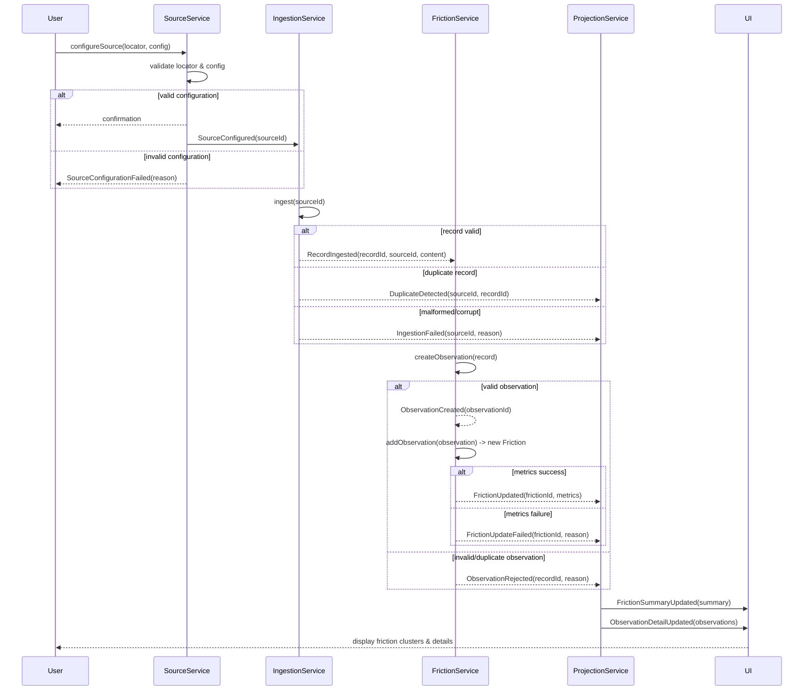
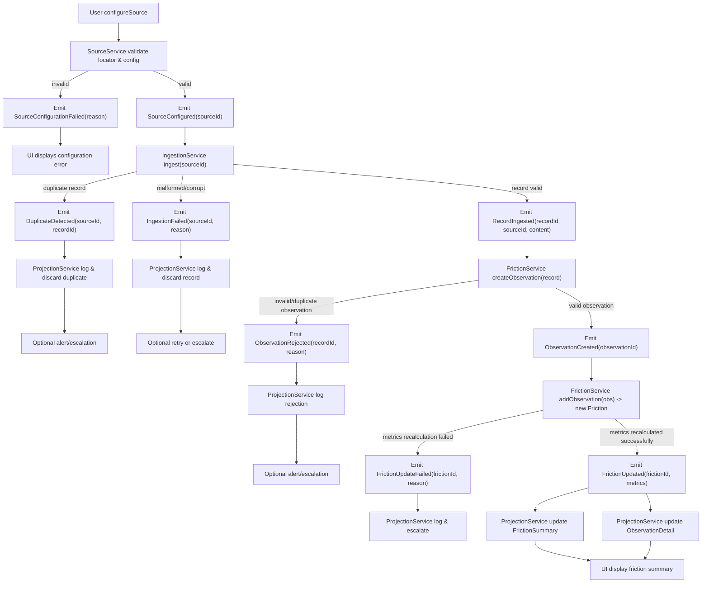

# Friction - Event-driven Architecture

This design is fully **DDD-aligned**, **EO-compliant**, and allows **horizontal scaling**: adding new sources, event handlers, or read models does not require changes to aggregates or the ingestion pipeline.

## **1. Event Types (including fail-fast)**

| Event                       | Source            | Payload                                                  | Notes                                       |
| --------------------------- | ----------------- | -------------------------------------------------------- | ------------------------------------------- |
| `SourceConfigured`          | SourceService     | `{sourceId, locatorType, locatorValue, config}`          | Success path                                |
| `SourceConfigurationFailed` | SourceService     | `{locator, reason}`                                      | Fail-fast invalid locator/config            |
| `IngestionRequested`        | SourceService     | `{sourceId, requestId, timestamp}`                       | Trigger ingestion                           |
| `IngestionFailed`           | IngestionService  | `{sourceId, reason}`                                     | Invalid/malformed/corrupt data              |
| `RecordIngested`            | IngestionService  | `{recordId, sourceId, content, timestamp}`               | Immutable raw record                        |
| `DuplicateDetected`         | IngestionService  | `{sourceId, recordId}`                                   | Duplicate prevention                        |
| `ObservationCreated`        | FrictionService   | `{observationId, recordId, sourceId, content, metadata}` | Normal path                                 |
| `ObservationRejected`       | FrictionService   | `{recordId, reason}`                                     | Duplicate, invalid content, metrics failure |
| `FrictionUpdated`           | FrictionService   | `{frictionId, addedObservations[], metrics}`             | Success path                                |
| `FrictionUpdateFailed`      | FrictionService   | `{frictionId, reason}`                                   | Metrics calculation failure                 |
| `FrictionSummaryUpdated`    | ProjectionService | `{frictionId, summary, topObservations}`                 | Projection updated                          |
| `ObservationDetailUpdated`  | ProjectionService | `{frictionId, observationDetails[]}`                     | Projection updated                          |

## **2. Enhanced Sequence Diagram with Fail-Fast Paths**

## **3. Aggregate & Service Reactions**

**Friction Aggregate**

- `addObservation(obs)` → returns new instance, throws exception if metrics fail
- No internal mutation; old instance preserved
- Metrics recalculation pure; exceptions propagate to service

**Observation**

- Immutable; rejected at creation if duplicate or invalid content
- Links to raw `IngestionRecord` for full traceability

**SourceService**

- Throws `SourceConfigurationFailed` event if locator/config invalid
- Validation early, fail-fast prevents downstream ingestion

**IngestionService**

- Rejects duplicates (`DuplicateDetected`)
- Rejects corrupt/malformed records (`IngestionFailed`)
- All failures emitted as events for monitoring/UI

**ProjectionService**

- Listens to success/failure events
- Updates read models only on valid paths
- Logs errors with full provenance, discards invalid events

**UI**

- Subscribes to projection events
- Presents error feedback alongside normal friction summaries

### Error-handling Strategy

