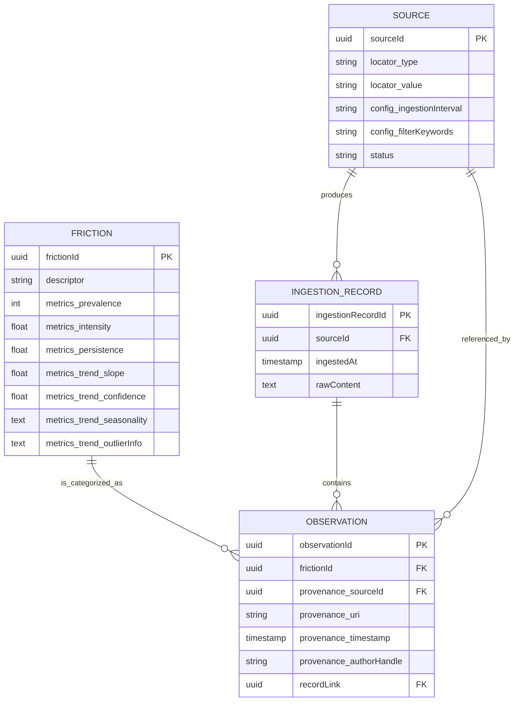

## **Friction – First Domain Model (DDD + EO)**





### **1. Aggregates**

#### **1.1 Source (Aggregate)**

- **Purpose:** Defines *where* data is collected from and encapsulates ingestion behavior.
- **Aggregate Root:** `Source` (Entity)
- **Identity:** `SourceID` (UUID)
- **State:**
  - `locator`: `SourceLocator` (VO) → describes type and location of source.
  - `config`: `SourceConfig` (VO) → ingestion parameters, filters, etc.
  - `status`: `SourceStatus` (Enum: ACTIVE, PAUSED)
- **Behavior (EO style):**
  - `ingest() → Stream<IngestionRecord>` → produces immutable raw records.
  - `pause()` / `resume()` → returns new `Source` instance with updated status.
  - `updateConfig(SourceConfig) → Source` → returns new `Source` instance with updated configuration.

**Value Objects inside Source:**

- `SourceLocator`: `{ type: String, value: String }`
- `SourceConfig`: `{ ingestionInterval: Duration, filterKeywords: List<String> }`

#### **1.2 Friction (Aggregate)**

- **Purpose:** Represents a recurring, unresolved problem, clustered from multiple observations.
- **Aggregate Root:** `Friction` (Entity)
- **Identity:** `FrictionID` (UUID)
- **State:**
  - `descriptor`: Short summary of the friction (system-generated).
  - `observations`: List of `Observation` entities → the evidence.
  - `metrics`: `FrictionMetrics` (VO) → computed scores (prevalence, intensity, persistence, trend).
- **Behavior (EO style):**
  - `addObservation(Observation) → Friction` → returns new aggregate instance with observation added and metrics recalculated.
  - `mergeWith(Friction) → Friction` → combines two clusters into a new aggregate with merged observations and recalculated metrics.
  - `present(Presenter)` → exposes data to UI, API, or report without exposing internal state.

**Entities inside Friction:**

- `Observation` (Entity)
  - Identity: `ObservationID`
  - State:
    - `provenance`: `Provenance` (VO) → tracks source, timestamp, author, URI.
    - `recordLink`: `IngestionRecordID` → immutable link to raw input.

**Value Objects inside Friction:**

- `FrictionMetrics`: `{ prevalence: Integer, intensity: Float, persistence: Float, trend: TemporalTrend }`
- `Provenance`: `{ sourceId: SourceID, uri: String, timestamp: Instant, authorHandle: String? }`
- `TemporalTrend`: `{ slope: Float, confidence: Float, optional seasonality/outlier info }`

### **2. Standalone Entity**

#### **IngestionRecord**

- **Purpose:** Immutable system of record for raw data captured from a `Source`.
- **Identity:** `IngestionRecordID`
- **State:**
  - `sourceId`: `SourceID`
  - `ingestedAt`: `Timestamp`
  - `rawContent`: Immutable copy of original data
- **Behavior:** None (pure record, append-only)

### **3. Relationships**

- `Source` → produces → many `IngestionRecord`s
- `Friction` → contains → many `Observation`s
- `Observation` → references → `Provenance` and `IngestionRecordID`
- `Friction` → aggregates metrics via `FrictionMetrics` VO
- Cross-domain: `SourceLocator.type` defines the field (Reddit, forum, HR system, etc.)

**Invariants / Fail-Fast Rules:**

- `Source` must have valid locator and config.
- `Friction` must have ≥1 observation.
- Metrics are recalculated on every addition of an observation.
- Observations are immutable once created; provenance always maintained.
- Merge of frictions deduplicates observations by provenance or ID.

### **4. Key Principles**

1. **Immutable Records:** No setters; all state changes produce new aggregate instances.
2. **Traceable Evidence:** Every metric is linked to raw input via `Provenance` and `IngestionRecord`.
3. **Behavior-First:** Aggregates expose actions (`ingest`, `addObservation`, `present`) rather than getters.
4. **Domain-Agnostic:** Works across software, healthcare, finance, manufacturing, education, etc.
5. **Metric-Driven:** All scoring is explicit, computed from observations, not heuristics or interpretation.
6. **Scalable:** New sources and fields can be added without touching core aggregates.

### **5. Summary UML-Like View (Textual)**

```yaml
Aggregate: Source
  Root: Source
  VO: SourceLocator, SourceConfig
  Entities: none
  Behavior: ingest(), pause(), resume(), updateConfig()

Aggregate: Friction
  Root: Friction
  Entities: Observation
  VO: FrictionMetrics, Provenance, TemporalTrend
  Behavior: addObservation(), mergeWith(), present()

Standalone Entity: IngestionRecord
  Identity: IngestionRecordID
  State: sourceId, ingestedAt, rawContent
```

