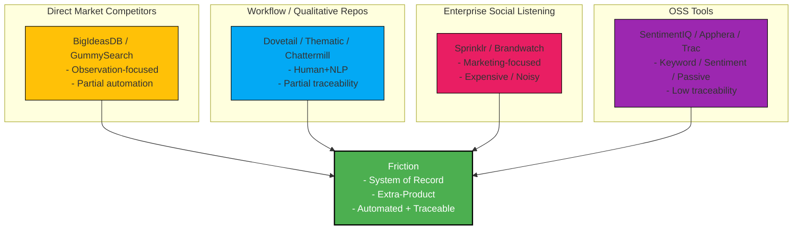
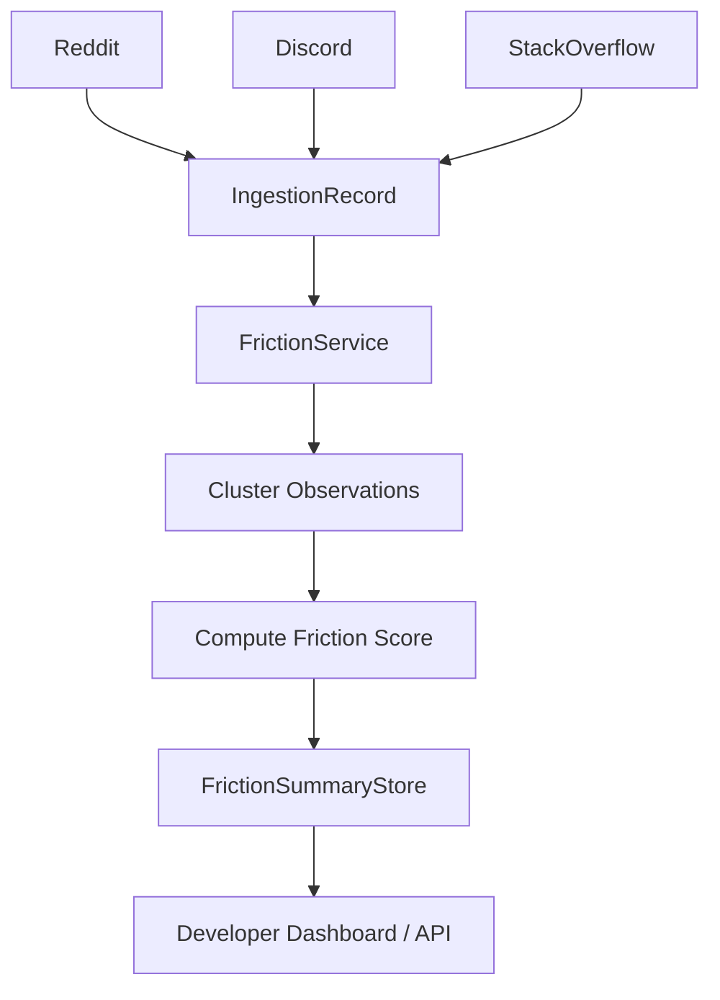

# Friction: Market & OSS Competitor Analysis

Friction is a **System of Record** for unresolved challenges. It does not tell you *what to build*, it shows the **traceable, immutable evidence of systemic pain** across forums, social media, and communities.

**Positioning:**

1. **Friction sits at the intersection of all categories**, taking inspiration from direct, workflow, enterprise, and OSS solutions but adding **automation, clustering, and immutable traceability**.
2. **Color coding** distinguishes audience and technical focus:
   - Green: Friction (developer-first, event-driven)
   - Amber: Direct Market (observation-focused)
   - Blue: Workflow Repos (human/NLP-assisted)
   - Pink: Enterprise (marketing-focused)
   - Purple: OSS (DIY, low traceability)
3. **Edges point toward Friction** to show how it consolidates capabilities that competitors only partially address.

## 1. Competitor Landscape

### A. Pain Point Scouts (Direct Market Competitors)

| Tool                         | Focus                   | Notes                             | Friction Advantage                                  |
| ---------------------------- | ----------------------- | --------------------------------- | --------------------------------------------------- |
| **BigIdeasDB**               | Reddit problem database | Scores pain points & maps to SaaS | Developer-first, event-driven, immutable provenance |
| **GummySearch**              | Audience research       | Legacy, partially deprecated      | Fully automated, cross-source clustering            |
| **SignalScouter / Redreach** | Social selling          | Suggests replies                  | Observation-only, no engagement                     |

### B. Qualitative Research Repositories

| Tool                       | Focus                          | Notes                      | Friction Advantage                          |
| -------------------------- | ------------------------------ | -------------------------- | ------------------------------------------- |
| **Dovetail**               | Tagging & qualitative analysis | Manual & human-interpreted | Automated, metric-driven, immutable         |
| **Thematic / Chattermill** | NLP on support tickets/reviews | Black-box scoring          | Full traceability to raw `IngestionRecord`s |

### C. Enterprise Social Listening

| Tool                      | Focus        | Notes            | Friction Advantage                                   |
| ------------------------- | ------------ | ---------------- | ---------------------------------------------------- |
| **Sprinklr / Brandwatch** | Marketing/PR | Noisy, expensive | Developer-focused, problem discovery outside product |

### D. Behavioral Friction Tools (Intra-product)

| Tool                      | Focus                  | Notes         | Friction Advantage                                     |
| ------------------------- | ---------------------- | ------------- | ------------------------------------------------------ |
| **FullStory / LogRocket** | Rage clicks, dead ends | Intra-product | Extra-product, proactive discovery, immutable evidence |

## 2. Open Source Landscape

### A. Sentiment Analysis & Reddit Scrapers

| OSS Tool                                                 | Gap                                                          |
| -------------------------------------------------------- | ------------------------------------------------------------ |
| `SentimentIQ`, `lit_or_not_on_reddit`, `reddit-analysis` | Detect sentiment but not *why*. No clustering of recurring problems. |

### B. Social Listening & Brand Monitoring

| OSS Tool                                  | Gap                                                    |
| ----------------------------------------- | ------------------------------------------------------ |
| `Apphera`, `open-social-media-monitoring` | Keyword-based. Misses conceptually similar complaints. |

### C. Feedback Aggregators / Issue Trackers

| OSS Tool                         | Gap                                                          |
| -------------------------------- | ------------------------------------------------------------ |
| `Trac`, `Canny-clones`, `Flarum` | Passive. Wait for posts. Friction actively collects external pain points. |

### D. System of Record Spiritual Peers

| OSS Tool   | Focus                  | Friction Relation                    |
| ---------- | ---------------------- | ------------------------------------ |
| `Milo`     | B2B cloud ops          | Provenance & event-driven philosophy |
| `DejaCode` | Open-source compliance | Immutable, traceable evidence        |

## 3. Core Differentiation

| Feature                     | Typical Competitors         | Friction                                          |
| --------------------------- | --------------------------- | ------------------------------------------------- |
| **Objective vs Subjective** | LLM interprets & recommends | Surfaces **pure evidence**, user decides solution |
| **Data Integrity**          | Mutable / overwritten       | **Immutable, append-only**                        |
| **Developer-First**         | Closed dashboards           | **API-first, event-driven**                       |
| **Traceability**            | Summary-level               | Every metric links to original source             |
| **Cross-Domain Clustering** | Rare                        | LLM-assisted synthesis of disparate complaints    |
| **Metric Standardization**  | Ad-hoc                      | Potential **Friction Score** as industry standard |

## 4. Competitive Moats

1. **Clustering Algorithm**: Groups conceptually similar complaints across sources better than generic LLMs.
2. **Friction Score**: Standardized metric for product-market friction, traceable to raw observations.
3. **Event-Driven Architecture (EDA)**: Scales horizontally without modifying aggregates.
4. **Immutable Provenance**: Every metric links to original ingestion record, audit-ready.

## 5. OSS Workflow Diagram

**Notes:**

- Active ingestion: Friction pulls from forums & social channels.
- Immutable: All records are append-only.
- Developer-first: Exposes API, not just dashboard.

## 6. Summary

- **No dominant OSS or commercial competitor** performs *Problem Discovery-as-a-Service*.
- Friction uniquely combines:
  1. **Social listening** (Reddit, Discord, StackOverflow)
  2. **Automated synthesis** (LLM clustering & metrics)
  3. **Immutable provenance** (event-driven, append-only)

**Positioning Statement:**
*"Friction surfaces the traceable evidence of systemic pain before a solution exists; turning disparate complaints into a trusted System of Record for developers and product teams."*