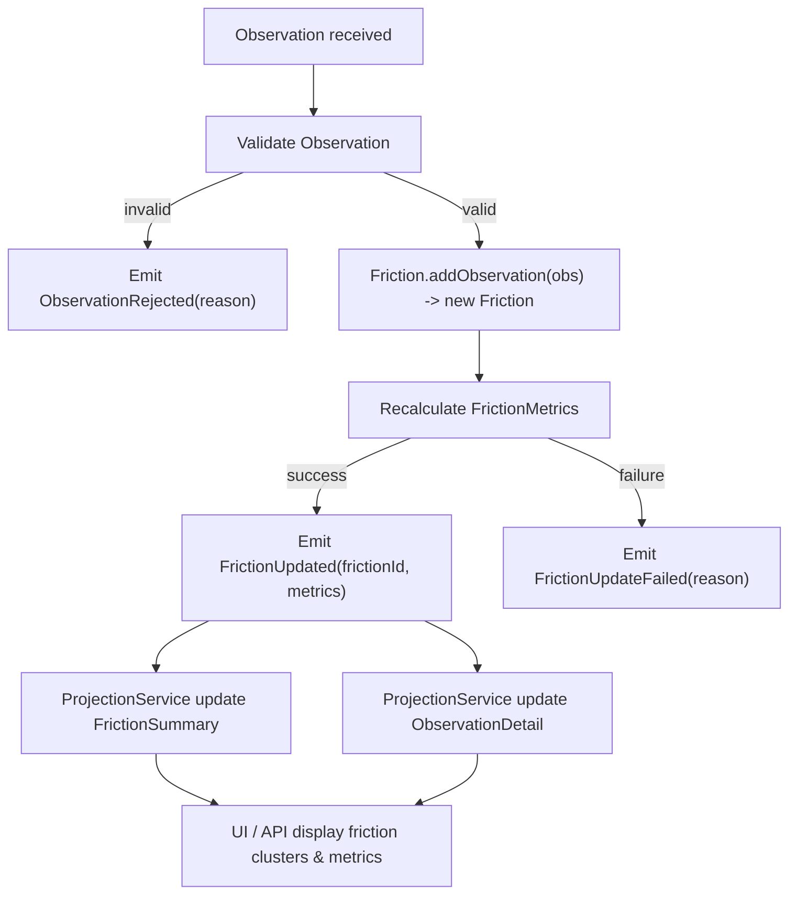
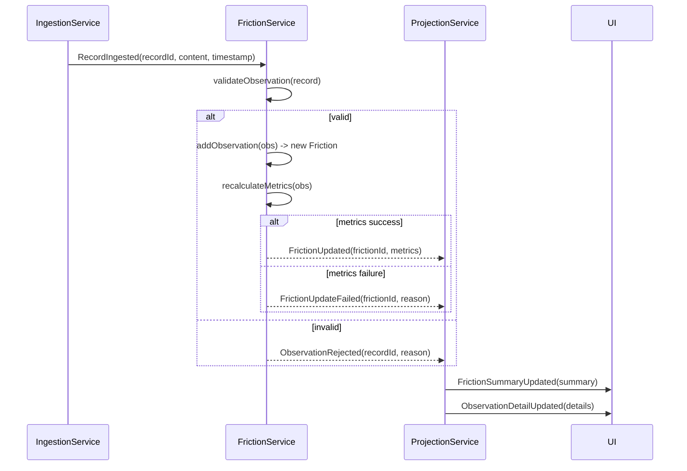

# Friction - Metrics Incremental Computation

This is a DDD- and EO-compliant design for advanced metrics in the **Friction** system. It preserves immutability, ensures traceability, and is fully event-driven. It focuses on **incremental computation**, fail-fast handling, and clear integration with projections and UI.

## **1. Value Objects & Aggregates**

### **FrictionMetrics (Immutable Value Object)**

```text
FrictionMetrics
- prevalence: int
- intensity: float
- persistence: Duration
- trend: TemporalTrend
- outliers: List<Outlier>
```

### **TemporalTrend (Immutable VO)**

```text
TemporalTrend
- slope: float
- confidence: float
- seasonalPattern: Map<TimeUnit, float>  // e.g., hourly/daily weightings
```

### **Observation (Immutable Entity)**

- Links to `IngestionRecord` for full provenance
- Contains `content`, `timestamp`, `metadata`
- Validated at creation; rejected observations never enter aggregates

### **Friction (Aggregate Root)**

- `addObservation(obs: Observation): Friction` → returns new instance
- `recalculateMetrics(obs: Observation): FrictionMetrics` → pure function
- Throws exception if metrics cannot be computed (fail-fast)

## **2. Metric Calculation Workflow (High-level)**



## **3. Incremental Metrics Computation**

**Prevalence**

- Count of observations with same key characteristics over a rolling window
- Incremental: $\ \text{prevPrevalence} + 1\\$ per new valid observation

**Intensity**

- Weighted sum of severity/engagement per observation
- Example: $\ \text{intensity} = \text{prevIntensity} \times \text{decayFactor} + \text{obs.engagementScore}$

**Persistence**

- Track first and last occurrence timestamps
- $\text{Duration} = \text{lastTimestamp} - \text{firstTimestamp}$
- Incremental update: only if `obs.timestamp` extends window

**Trend (TemporalTrend VO)**

- Maintain sliding time series of observations ($\frac{\text{count/intensity}}{\text{time unit}}$)

- Compute slope with simple linear regression:

  ```math
  \begin{align*}
  \text{slope} &= \frac{\sum (x - \bar{x})(y - \bar{y})}{\sum (x - \bar{x})^2} \\
  \text{confidence} &= r^2 \quad \text{(from regression)}
  \end{align*}
  ```

- Seasonal pattern: bucket observations by hour/day/week, normalize counts

**Outliers**

- `z-score` or modified `z-score` per time bucket:

  ```math
  z = \frac{\text{value} - \text{mean}}{\text{stddev}}
  ```

- Flag if $|z| > \text{threshold}$ → add to `outliers` list

## **4. Event-driven Integration**

1. **ObservationCreated** → triggers `Friction.addObservation`
2. **FrictionUpdated** → triggers projections
   - `FrictionSummaryUpdated` → aggregated metrics
   - `ObservationDetailUpdated` → metrics per observation
3. **FrictionUpdateFailed** → triggers logging, alerts, and optionally UI error display

All events are immutable, traceable, and contain enough context to reconstruct state.

## **5. Fail-Fast & Data Integrity**

- Reject `Observation` if:
  - Missing timestamp or content
  - Duplicate ingestion record
  - Invalid metadata
- Throw exception during `recalculateMetrics` if:
  - Regression cannot be computed (e.g., $< 2 \ \text{observations}$)
  - `temporalTrend` computation fails
- Failures emitted as `ObservationRejected` or `FrictionUpdateFailed`

## **6. Data Flow (Detailed Mermaid Sequence)**



## **7. Notes on Implementation**

- **Immutability**: every `addObservation` returns a new `Friction` instance; old instance preserved
- **Traceability**: `Observation` retains raw `IngestionRecord` reference
- **Projection decoupling**: read models subscribe to `FrictionUpdated` and `ObservationRejected`
- **Scalability**: multiple Friction aggregates can be updated in parallel; trends computed independently
- **`temporalTrend` and `outliers`** can be computed lazily on-demand if history is large
