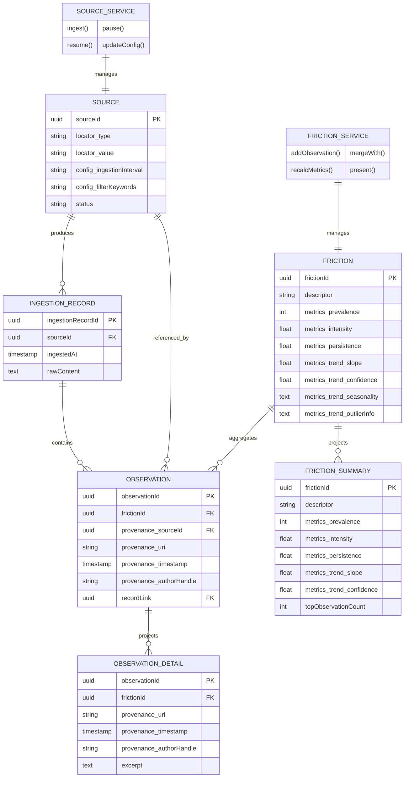
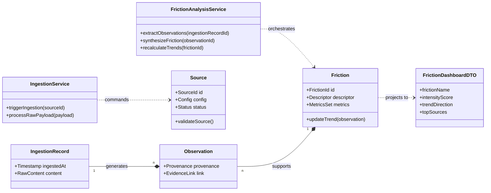

# Friction - product-level UML

Models the Friction domain model into a **product-level UML** with **application services, read models, and flows**, keeping DDD + EO principles intact.

### What it does:

1. Keeps **aggregates immutable** (`Source`, `Friction`) with behavior-only interfaces (`SourceService`, `FrictionService`).
2. Adds **read models** (`FrictionSummary`, `ObservationDetail`) for **UI / API consumption**, without exposing aggregate internals.
3. Shows the **data flow** from ingestion → observations → friction → projections → presentation.
4. Keeps **traceability** intact: every `ObservationDetail` links back to `IngestionRecord` and `Provenance`.

### from Gemini

