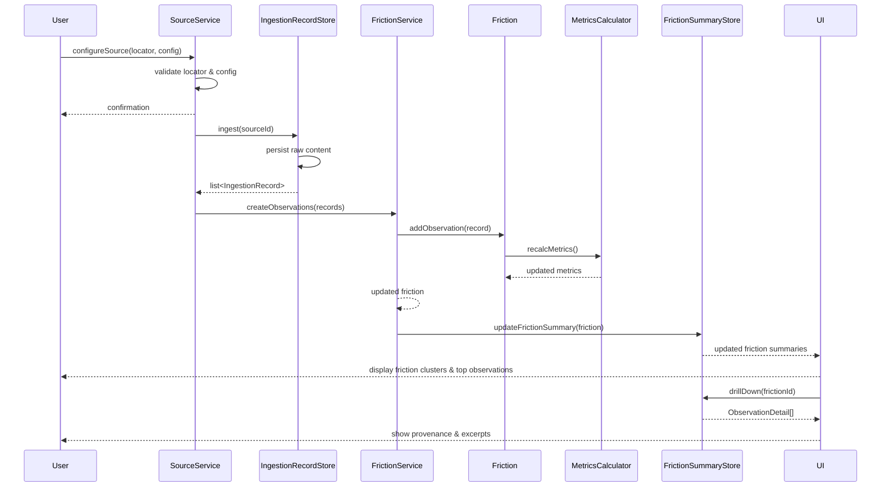

# Friction - Sequence Diagram

The Friction **full sequence diagram** showing the **end-to-end flow** from user configuring sources to friction metrics surfacing in the UI. This captures the **dynamic behavior** of the application while keeping DDD + EO principles intact.

### Key Points:

1. **Behavior-first:** Aggregates (`Source`, `Friction`) never expose internal state: services handle orchestration.
2. **Immutable flow:** Each addition (`addObservation`) returns a new friction instance with recalculated metrics.
3. **Traceable evidence:** `ObservationDetail` links back to `IngestionRecord` and provenance info.
4. **Projections / read models:** `FrictionSummary` and `ObservationDetail` keep UI fast and decoupled from aggregate internals.
5. **Scalable design:** You can add new sources, metrics, or filters without touching aggregates.

