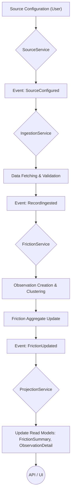
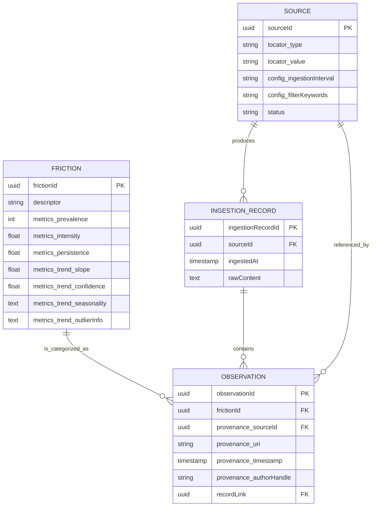
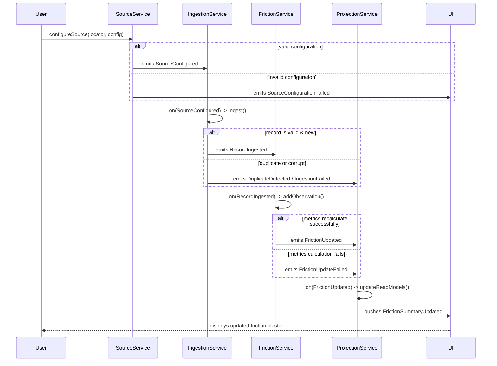

# Friction: Technical and Conceptual Overview

Friction is a **system of record for recurring, unresolved challenges across any domain**, capturing what slows progress, frustrates participants, or produces inefficiencies. Its role is **observation, measurement, and traceability**, not solving problems for the user. It is designed as a developer-first, metric-driven platform with immutable, traceable, and scalable architecture.

## 1. Core Function

1. **Ingest**: Collect publicly available discourse from one or more sources (Reddit is the initial implementation). Accept configurable domains or topics and persist raw input in an append-only, immutable store.
2. **Detect Recurring Patterns**: Identify repeated mentions of issues, obstacles, or friction points. Recognize clusters of related complaints and track frequency, engagement, and temporal trends, while retaining provenance (timestamp, source, author).
3. **Measure and Score**: Quantify prevalence, intensity or severity, persistence over time, and engagement gaps. Generate metrics that make friction **comparable** across topics or domains.
4. **Aggregate and Surface**: Summarize high-impact frictions, highlight emerging or persistent problem areas, and enable filtering and grouping by topic, field, severity, and time window. Provide drill-down to the original source context for verification.
5. **Present Evidence**: Provide a UI, report, or API that shows measurable patterns, examples of the friction, and traceable sources. The system avoids interpretation or advice and surfaces data objectively.

## 2. Value Proposition

* **For creators/users**: Quickly identify unsolved problems to focus effort, development, or research.
* **For teams or analysts**: Provide evidence of recurring friction, reduce guesswork, and highlight opportunities.
* **For portfolio purposes**: Demonstrates disciplined, immutable, metric-driven design, cross-domain applicability, and a clear mapping from raw data to structured insight.

## 3. Architecture & Design Principles

Friction is built on modern, robust architectural principles designed for scalability, maintainability, and domain clarity.  

* **Architecture Style:** Event-Driven Architecture (EDA) combined with Domain-Driven Design (DDD) and Elegant Objects (EO) principles.  
* **Immutability:** All domain objects, especially Aggregates and Events, are immutable. State changes result in new object instances, preserving a traceable history and ensuring thread safety.  
* **Traceability / Provenance:** Every derived metric or friction cluster can be traced to its raw source (`IngestionRecord`). This is an evidence-first, non-negotiable constraint.  
* **Domain-Agnostic:** The core model is not tied to a specific domain. It can operate in software, healthcare, manufacturing, education, finance, or any field where recurring challenges can be observed.  
* **CQRS (Command Query Responsibility Segregation):** Write-side operations are handled by Aggregates (`Source`, `Friction`), while read-side operations are served by optimized Read Models (`FrictionSummary`, `ObservationDetail`).  
* **Fail-Fast:** Validation occurs at the earliest possible moment. Invalid configurations, corrupt data, or duplicate records are rejected immediately, emitting failure events instead of allowing invalid state to propagate.  
* **Metric-Driven:** Core operations never rely on subjective interpretation; all outputs are quantifiable and comparable.  
* **Incremental & Observable:** Can scale horizontally to new fields or data sources without redesign, supporting incremental adoption and evolution.  

## 4. Design Philosophy

Friction embodies a **developer-first, evidence-driven mindset**:

* Raw observations are preserved immutably.  
* Metrics are derived objectively, never inferred or interpreted.  
* Every artifact is traceable and auditable.  
* The system is horizontally extensible to accommodate new data sources, domains, or analysis workflows.  
* The UI or API surfaces structured, verifiable data without recommending actions or conclusions. 

### 4.1. High-Level Data Flow

The end-to-end data pipeline is designed as a one-way flow from raw data ingestion to insightful, aggregated presentation.



## 5. Domain Model

The core logic of the system is encapsulated in two primary aggregates and one standalone entity.



### 5.1. Aggregates & Entities

*   **`Source` (Aggregate Root)**
    *   **Responsibility:** Defines a data source and its configuration. It is the boundary for all ingestion-related commands.
    *   **Identity:** `SourceId` (UUID)
    *   **Value Objects:**
        *   `SourceLocator`: `{type: String, value: String}` (e.g., `{type: "REDDIT", value: "r/javahelp"}`)
        *   `SourceConfig`: `{ingestionInterval: Duration, filterKeywords: List<String>}`
    *   **Behaviors:** `configure()`, `pause()`, `resume()`, `updateConfig()`
    *   **Invariants:** A `Source` cannot be created with an invalid or unreachable locator. The configuration must pass validation.

*   **`Friction` (Aggregate Root)**
    *   **Responsibility:** Represents a single, recurring, unresolved challenge identified from multiple observations. It is the consistency boundary for all metrics and evidence.
    *   **Identity:** `FrictionId` (UUID)
    *   **Entities:**
        *   `Observation`: A single piece of evidence pointing to this friction. Contains `Provenance` and a link to the `IngestionRecord`.
    *   **Value Objects:**
        *   `FrictionMetrics`: `{prevalence: int, intensity: float, persistence: Duration, trend: TemporalTrend}`
        *   `Provenance`: `{sourceId: SourceID, uri: String, timestamp: Instant, authorHandle: String}`
        *   `TemporalTrend`: `{slope: float, confidence: float, seasonalPattern: Map}`
    *   **Behaviors:** `addObservation(Observation)`, `mergeWith(Friction)`
    *   **Invariants:** Must contain at least one `Observation`. All metrics are recalculated atomically whenever a new `Observation` is added. A `FrictionUpdateFailed` event is emitted if metrics calculation fails.

*   **`IngestionRecord` (Standalone Entity)**
    *   **Responsibility:** Represents the raw, immutable, append-only record of ingested data. It is the foundational "evidence" and is never modified once created.
    *   **Identity:** `IngestionRecordId` (UUID)
    *   **State:** `sourceId`, `ingestedAt`, `rawContent`.

### 5.2. Read Models (Projections)

These are denormalized data structures optimized for querying by the API/UI. They are updated asynchronously by the `ProjectionService`.

*   **`FrictionSummary`**
    *   **Purpose:** To display a list of high-impact frictions.
    *   **Fields:** `frictionId`, `descriptor`, `prevalence`, `intensity`, `persistence`, `trend_slope`.
*   **`ObservationDetail`**
    *   **Purpose:** To provide drill-down evidence for a specific friction.
    *   **Fields:** `observationId`, `provenance_uri`, `provenance_timestamp`, `provenance_authorHandle`, `content_excerpt`.

## 6. Event-Driven Design

The system is choreographed by a series of immutable domain events.

| Event Name                  | Emitter Service     | Payload                                        | Purpose & Fail-Fast Notes                                    |
| :-------------------------- | :------------------ | :--------------------------------------------- | :----------------------------------------------------------- |
| `SourceConfigured`          | `SourceService`     | `{sourceId, locator, config}`                  | Signals a new, valid source is ready for ingestion.          |
| `SourceConfigurationFailed` | `SourceService`     | `{locator, reason}`                            | **Fail-Fast:** Emitted if locator is invalid or config fails validation. Prevents ingestion. |
| `RecordIngested`            | `IngestionService`  | `{recordId, sourceId, content, timestamp}`     | A new piece of raw data has been successfully ingested and stored. |
| `IngestionFailed`           | `IngestionService`  | `{sourceId, reason}`                           | **Fail-Fast:** Emitted if data is corrupt, malformed, or cannot be read. |
| `DuplicateDetected`         | `IngestionService`  | `{recordId, sourceId}`                         | **Fail-Fast:** Emitted if the ingested record is a known duplicate. Prevents re-processing. |
| `ObservationCreated`        | `FrictionService`   | `{observationId, recordId, content}`           | A valid observation has been extracted from an ingestion record. |
| `ObservationRejected`       | `FrictionService`   | `{recordId, reason}`                           | **Fail-Fast:** Emitted if an observation is a duplicate or lacks required content/metadata. |
| `FrictionUpdated`           | `FrictionService`   | `{frictionId, newMetrics, addedObservationId}` | The `Friction` aggregate was successfully updated with a new observation and metrics. |
| `FrictionUpdateFailed`      | `FrictionService`   | `{frictionId, observationId, reason}`          | **Fail-Fast:** Emitted if metrics recalculation fails (e.g., division by zero). Critical for monitoring. |
| `FrictionSummaryUpdated`    | `ProjectionService` | `{frictionId, summary}`                        | The read model for a friction's summary has been updated.    |

## 7. Component Breakdown & Pipelines

### 7.1. Services (Application Layer)

*   **`SourceService`:**
    *   **Responsibilities:** Handles commands related to `Source` configuration. Validates locators and configs. Emits `SourceConfigured` or `SourceConfigurationFailed`. Triggers the ingestion process.
*   **`IngestionService`:**
    *   **Responsibilities:** Subscribes to `SourceConfigured`. Fetches data from sources. Validates raw data for integrity. Prevents duplicates. Persists `IngestionRecord`s. Emits `RecordIngested`, `DuplicateDetected`, or `IngestionFailed`.
*   **`FrictionService`:**
    *   **Responsibilities:** Subscribes to `RecordIngested`. Orchestrates the extraction of `Observation`s from records. Determines if an observation belongs to an existing `Friction` or a new one. Executes the `Friction.addObservation()` command. Emits `FrictionUpdated` or `FrictionUpdateFailed`.
*   **`ProjectionService`:**
    *   **Responsibilities:** A-political subscriber to all success and failure events. Updates the `FrictionSummary` and `ObservationDetail` read models. Handles logging and can be extended for monitoring/alerting.

### 7.2. End-to-End Sequence

This diagram shows the complete, successful flow from configuration to UI presentation.



## 8. Open Questions & Assumptions

* **Observation Clustering Logic:** The algorithm for grouping `Observation`s into a `Friction` aggregate is undefined. Options include keyword matching, NLP-based semantic similarity, or another method. This logic will reside in `FrictionService`.
* **Descriptor Generation:** How the `Friction.descriptor` string is derived is not specified. Likely from the most common terms or representative phrases in its observations.
* **Merge Strategy:** The behavior of `Friction.mergeWith()` is not fully defined. It must be clarified what triggers a merge—an external process, user action, or automated rule—when two frictions are duplicates.
* **Metrics Calculation Details:** Specific formulas and weighting factors for `intensity`, `trend`, and other metrics are not finalized. The system must also define metrics behavior for a `Friction` with fewer than two observations (e.g., default metrics or null-safe values).
* **Security & Access Control:** Strategies for securing sensitive configuration data (`SourceConfig` may contain API keys) and controlling access to source configuration or friction data are not detailed.
* **Scalability and Performance:** While horizontal scaling is assumed, specific strategies for data partitioning, high-volume ingestion, and efficient clustering are not defined.

## 9. Recommended Java Project Structure

A multi-module Maven or Gradle project is recommended to enforce separation of concerns and align with DDD layers.

```
friction/
├── pom.xml
├── friction-domain        # Core aggregates, entities, VOs, events. No dependencies.
│   └── src/main/java/com/friction/domain/
│       ├── model/
│       │   ├── source/
│       │   │   ├── Source.java
│       │   │   └── vo/
│       │   └── friction/
│       │       ├── Friction.java
│       │       ├── Observation.java
│       │       └── vo/
│       └── events/
│
├── friction-application   # Application services, orchestration logic.
│   └── src/main/java/com/friction/application/
│       ├── service/
│       │   ├── SourceService.java
│       │   ├── IngestionService.java
│       │   └── FrictionService.java
│       └── port/         # Interfaces for persistence, external APIs
│
├── friction-adapter/
│   ├── friction-ingestion   # Adapters for external sources (Reddit, RSS).
│   │   └── src/main/java/com/friction/adapter/ingestion/
│   ├── friction-persistence # Implementation of persistence ports (JPA, JDBC).
│   │   └── src/main/java/com/friction/adapter/persistence/
│   └── friction-api         # REST/GraphQL controllers, DTOs, read models.
│       └── src/main/java/com/friction/adapter/api/
│
└── friction-launcher      # Main application, configuration, dependency injection.
    └── src/main/java/com/friction/launcher/
```

This structure ensures that the `friction-domain` module remains pure and isolated, with dependencies flowing inward, adhering to the principles of Clean Architecture and DDD.